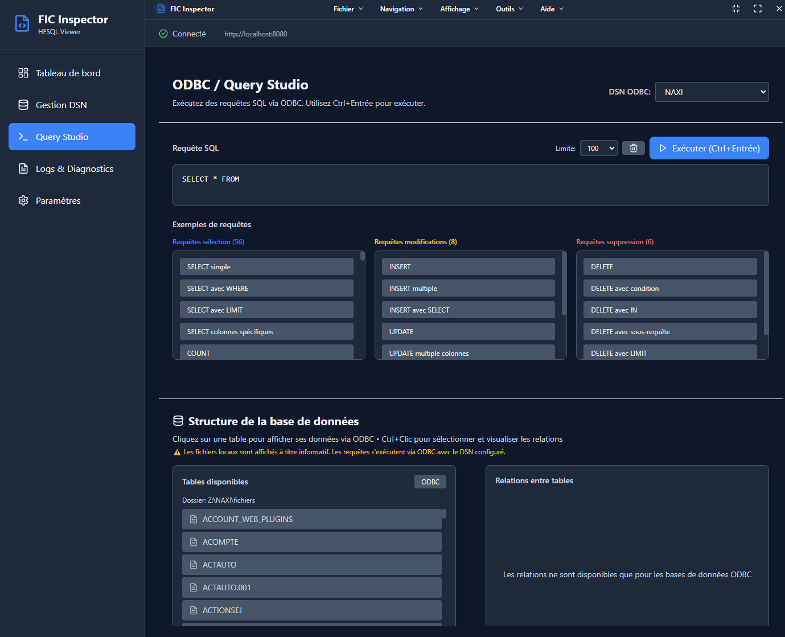

# FIC Engine & Inspector


<div align="center">


**Solution simple pour lire et explorer vos fichiers HFSQL/HyperFile**

</div>



*Éditeur SQL avec historique et exemples de requêtes*


---

## Qu'est-ce que FIC Engine & Inspector ?

FIC Engine & Inspector est un outil qui vous permet de lire et d'explorer vos fichiers HFSQL/HyperFile (extensions `.fic`, `.mmo`, `.ndx`) sans avoir besoin de l'application originale.

**Avec cet outil, vous pouvez :**
- Visualiser vos données dans une interface graphique moderne
- Exporter vos données en JSON ou CSV
- Exécuter des requêtes SQL sur vos fichiers
- Migrer vos données vers d'autres formats

---

## Installation

###  Compiler depuis les sources

#### Prérequis

- **Rust** (1.70 ou supérieur) : [https://rustup.rs/](https://rustup.rs/)
- **Node.js** (18 ou supérieur) : [https://nodejs.org/](https://nodejs.org/)

#### Installation

```bash
# Cloner le dépôt
git clone https://github.com/Samvel070903/HFSQL-Classic-Fic-inspector
cd HFSQL-Classic-Fic-inspector

# Compiler le backend
cargo build --release

# Installer et compiler l'interface graphique
cd fic-inspector
npm install
npm run build
```

---

## Démarrage rapide

### 1. Démarrer le serveur

Ouvrez un terminal et exécutez :

```bash
cargo run --release -- serve
```

Le serveur démarre sur `http://127.0.0.1:8080`

### 2. Ouvrir l'interface graphique

```bash
cd fic-inspector
npm run dev
```

L'application s'ouvre automatiquement dans une fenêtre.

### 3. Sélectionner vos fichiers

1. Cliquez sur "Sélectionner un dossier" dans l'interface
2. Choisissez le dossier contenant vos fichiers `.fic`, `.mmo`, `.ndx`
3. Les tables sont automatiquement détectées et affichées

### 4. Explorer vos données

- **Dashboard** : Vue d'ensemble de toutes vos tables
- **Tables** : Cliquez sur une table pour voir ses enregistrements
- **SQL/ODBC** : Exécutez des requêtes SQL directement
- **Logs** : Consultez les logs du serveur

---

## Fonctionnalités principales

### Interface graphique

- **Dashboard interactif** : Vue d'ensemble de vos tables avec statistiques
- **Inspection visuelle** : Parcourez vos enregistrements facilement
- **Éditeur SQL** : Exécutez des requêtes SQL avec historique
- **Visualisation des relations** : Voyez les liens entre vos tables
- **Thème sombre** : Interface moderne et agréable

### Export de données

Exportez vos données en différents formats :

```bash
# Exporter en JSON
cargo run --release -- export MA_TABLE --format json --output export.json

# Exporter en CSV
cargo run --release -- export MA_TABLE --format csv --output export.csv
```

### Requêtes SQL

Exécutez des requêtes SQL directement sur vos fichiers :

```sql
-- Lister tous les clients
SELECT * FROM CLIENT;

-- Rechercher un client spécifique
SELECT * FROM CLIENT WHERE nom = 'Dupont';

-- Limiter les résultats
SELECT * FROM CLIENT LIMIT 10;
```

---

## Configuration

Créez un fichier `config.toml` à la racine du projet :

```toml
# Dossier contenant vos fichiers .fic, .mmo, .ndx
data_dir = "./data"

[api]
host = "127.0.0.1"
port = 8080
cors_enabled = true

[storage]
read_only = true  # Mode lecture seule (recommandé)
```

---

## Support

### Support communautaire

- **GitHub Issues** : [Signaler un problème](https://github.com/Samvel070903/HFSQL-Classic-Fic-inspector/issues)
- **Discussions** : [Poser une question](https://github.com/Samvel070903/HFSQL-Classic-Fic-inspector/discussions)

### Support professionnel

Pour un support professionnel, contactez :

**Email** : samvelpro@gmail.com

**Services disponibles :**
- Support technique prioritaire
- Formation sur site
- Développement de fonctionnalités sur mesure
- Migration de données assistée

---

## Licence

Ce projet est distribué sous une double licence :

- **MIT License**
- **Apache License 2.0**

Vous pouvez choisir la licence qui vous convient le mieux.

---

<div align="center">

**FIC Engine & Inspector** - Solution simple pour vos fichiers HFSQL

Pour toute question : samvelpro@gmail.com

</div>
